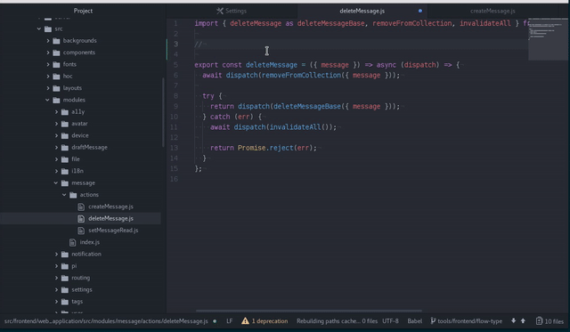

# Frontend development

This documentation describe how to start the backend in docker container and the frontend in a native way.

## Setup the docker_compose stack

you need to have [docker](https://docs.docker.com/engine/installation/) and [docker compose](https://docs.docker.com/compose/) installed on your machine.

Services available in the docker compose stack are:

- redis
- elasticsearch
- cassandra
- object store (minio for now)
- caliopen's api (api)
- caliopen's frontend (frontend)
- caliopen's lmtp service (broker)

You can start storage services using these commands:

```
cd devtools
docker-compose pull
docker-compose up -d redis cassandra elasticsearch
```
(wait few seconds for cassandra to warm-up)

Using caliopen cli tool:
* You must setup storage and some basic configuration (TTL for notifications):
```
cd devtools
docker-compose run cli setup
```

* You should create an admin user with the same username as in `configs/caliopen-go-api_dev.yaml`
```
docker-compose run cli create_user -e admin -p 123456
```

* Then, you could create an user and import email
```
docker-compose run cli create_user -e dev -p 123456
docker-compose run cli import -e dev@caliopen.local -f mbox -p devtools/fixtures/mbox/dev@caliopen.local
```

**NB** : data are persisted after containers are stopped, even after being destroyed.

Finally start the stack

```
docker-compose up -d frontend broker
```

**NB** : for now, outgoing emails are caught by a local smtp server for testing purpose.

You will have a Caliopen instance filled with data, accessible from your browser on localhost:4000.  
You could check outgoing emails by pointing your browser at localhost:8888.  

### Remote identities poller and workers
To automatically fetch emails from remote IMAP accounts you need to :
1. launch _identityworker_
2. create a _remote identity_ for user _dev_
3. launch _identitypoller_

##### 1. launch _imap_worker_

`docker-compose up -d identity_worker`

##### 2. create a _remote identity_ for user _dev_:

- Create at least one remote identity for user _dev_. Enter email account (-l), password (-p), server address (-s) and user_name for _dev_ account (-u) :  

`docker-compose run --no-deps --entrypoint imapctl identity_worker addremote -l 'your_email@gmail.com' -p 'your_secret_password' -s 'imap.gmail.com:993' -u 'dev'`  

##### 3. launch _ids_poller_

`docker-compose up -d identity_poller`

_ids_poller_ will retrieve remote identities from cassandra and schedule fetching jobs accordingly on a regularly basis.  
You can add more remote identities later, they will be retrieve by _ids_poller_ as well.

## Start frontend natively

**Requirements:**

* You need [node](https://nodejs.org/en/) v8 or later
* You need [yarn](https://yarnpkg.com/en/docs/install) to manage dependencies.
* Enventually stop the frontend container `docker-compose stop frontend`

Then develop locally using your normal practices:

```
cd src/frontend/web_application
yarn install
npm start
```

It's a bit long to compile.
The first time you will see some errors about a missing file, it will be fixed at the end of the compilation.

## Rebuild a container

In case the image of a service (api or apiv1 ...) is not up-to-date, you mmight need to rebuild a container.

_Replace "api" by the service you want to rebuild_

```
docker-compose build api
docker-compose stop api
docker-compose up -d api
```

## Fresh install

To reset containers and data:

```
docker-compose stop

# remove containers :
docker-compose rm

# remove volumes created by containers :
docker volume rm devtools_db devtools_index devtools_store
```

## Developing using flow type

Caliopen includes [Flow](https://flow.org) in the client code to make it more friendly.



You need to start a flow server and you would be able to see the flow status with the same command:

```
yarn flow
```

_(use `yarn flow --help` for more informations)_

And then use a [plugin](https://flow.org/en/docs/editors/) on your editor to make the thing available.

**note:** It is not mandatory to type the code when you are contributing. And so not the whole code is typed as well.

## Troubleshoutings

**elasticsearch won't start**:

According to [this issue](https://github.com/docker-library/elasticsearch/issues/111), you might solve it with this command on the host:

```
sysctl -w vm.max_map_count=262144

# make it permanent:
echo "vm.max_map_count = 262144" > sudo tee /etc/sysctl.d/vm.caliopen.conf
```

**frontend does not build**

The following error may appears:

```
Module build failed: Error: ENOENT: no such file or directory, scandir '/.../CaliOpen/Caliopen/src/frontend/web_application/node_modules/node-sass/vendor
```

It is related to [node-sass](https://github.com/sass/node-sass/issues/1579#issuecomment-227661284)
installation. To fix the easiest way is to remove `node_modules` then reinstall with yarn:

```
(cd src/frontend/web_application/ && rm -r node_modules && yarn)
```

or rebuild node-sass:

```
npm rebuild node-sass
```
